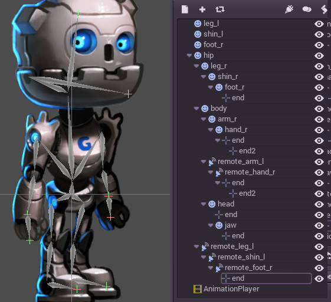

# Cutout Animation

### What is it?

Cut-out is a technique of animating in 2D where pieces of paper (or similar material) are cut in special shapes and laid one over the other. The papers are animated and photographed, frame by frame using a stop motion technique (more info [here](http://en.wikipedia.org/wiki/Cutout_animation).

With the advent of the digital age, this technique became possible using computers, which resulted in an increased amount of animation TV shows using digital Cut-out. Notable examples are [South Park](http://en.wikipedia.org/wiki/South_Park) or [Jake and the Never Land Pirates](http://en.wikipedia.org/wiki/Jake_and_the_Never_Land_Pirates).

In video games, this technique also become very popular. Examples of this are [Paper Mario](http://en.wikipedia.org/wiki/Super_Paper_Mario) or [Rayman Origins](http://en.wikipedia.org/wiki/Rayman_Origins).

### Cutout in Godot

Godot provides a few tools for working with these kind of assets, but it's overall design makes it ideal for the workflow. The reason is that, unlike other tools meant for this, Godot has the following advantages:

* **The animation system is fully integrated with the engine**: This means, animations can control much more than just motion of objects, such as textures, sprite sizes, pivots, opacity, color modulation, etc. Everything can be animated and blended.
* **Mix with Traditional**: AnimatedSprite allows traditional animation to be mixed, very useful for complex objects, such as shape of hands and foot, changing face expression, etc.
* **Custom Shaped Elements**: Can be created with [Polygon2D](class_polygon2d) allowing the mixing of UV animation, deformations, etc.
* **Particle Systems**: Can also be mixed with the traditional animation hierarchy, useful for magic effecs, jetpacks, etc.
* **Custom Colliders**: Set colliders and influence areas in different parts of the skeletons, great for bosses, fighting games, etc.
* **Animation Tree**: Allows complex combinations and blendings of several animations, the same way it works in 3D. 

And much more!

### Making of GBot!

For this tutorial, we will use as demo content the pieces of the [GBot](https://www.youtube.com/watch?v=S13FrWuBMx4&list=UUckpus81gNin1aV8WSffRKw) character, created by Andreas Esau. 

Get your assets [here](media/gbot_resources.zip).

### Setting up the Rig

Create an empty Node2D as root of the scene, weĺl work under it:

OK, the first node of the model that we will create will be the hip. Generally, both in 2D and 3D, the hip is the root of the skeleton. This makes it easier to animate:

Next will be the torso. The torso needs to be a child of the hip, so create a child sprite and load the torso, later accommodate it properly:

This looks good. Let's try if our hierarchy works as a skeleton by rotating the torso:

Ouch, that doesn't look good! The rotation pivot is wrong, this means it needs to be adjusted.
This small little cross in the middle of the [Sprite](class_sprite) is the rotation pivot:

#### Adjusting the Pivot

The Pivot can be adjusted by changing the _offset_ property in the Sprite:

However, there is a way to do it more _visually_. Pick the object and move it normally. After the motion has begun and while the left mouse button is being held, press the "v" key **without releasing** the mouse button. Further motion will move the object around the pivot. This small tool allows adjusting the pivot easily. Finally, move the pivot to the right place:

Now it looks good! Let's continue adding body pieces, starting by the right arm. Make sure to put the sprites in hierarchy, so their rotations and translations are relative to the parent:

This seems easy, so continue with the right arm. The rest should be simple! Or maybe not:

Right. Remember your tutorials, Luke. In 2D, parent nodes appear below children nodes. Well, this sucks. It seems Godot does not support cutout rigs after all. Come back next year, maybe for 1.2.. no wait. Just Kidding! It works just fine.

But how can this problem be solved? We want the whole to appear behind the hip and the torso. For this, we can move the nodes behind the hip:

But then, we lose the hierarchy layout, which allows to control the skeleton like.. a skeleton. Is there any hope?.. Of Course!

#### RemoteTransform2D Node

Godot provides a special node, [RemoteTransform2D](class_remotetransform2d). This node will transform nodes that are sitting somewhere else in the hierarchy, by copying it's transform to the remote node.
This enables to have a visibility order independent from the hierarchy. 

Simply create two more nodes as children from torso, remote_arm_l and remote_hand_l and link them to the actual sprites:

Moving the remote transform nodes will move the sprites, allowing to easily animate and pose the character:

#### Completing the Skeleton

Complete the skeleton by following the same steps for the rest of the parts. The resulting scene should look similar to this:

The resulting rig should be easy to animate, by selecting the nodes and rotating them you can animate forward kinematic (FK) efficiently. 

For simple objects and rigs this is fine, however the following problems are common:

* Selecting sprites can become difficult for complex rigs, and the scene tree ends being used due to the difficulty of clicking over the proper sprite.
* Inverse Kinematics is often desired for extremities.

To solve these problems, Godot supports a simple method of skeletons.

### Skeletons

Godot _does not really_ support actual skeletons. What exists is a helper to create "bones" between nodes. This is enough for most cases, but the way it works is not completely obvious. 

As an example, let's turn the right arm into a skeleton. To create skeletons, a chain of nodes must be selected from top to bottom:

Then, the option to create a skeleton is located at Edit -> Skeleton -> Make Bones:

This will add bones covering the arm, but the result is not quite what is expected.

It looks like the bones are shifted up in the hierarchy. The hand connects to the arm, and the arm to the body. So the question is:

* Why does the hand lack a bone?
* Why does the arm connect to the body?

This might seem strange at first, but will make sense later on. In traditional skeleton systems, bones have a position, an orientation and a length. In Godot, bones are mostly helpers so they connect the current node with the parent. Because of this, **toggling a node as a bone will just connect it to the parent**.

So, with this knowledge. Let's do the same again so we have an actual, useful skeleton. 

The first step is creating an endpoint node. Any kind of node will do, but [Position2D](class_position2d) is preferred because it's visible in the editor. The endpoint node will ensure that the last bone has orientation

Now select the whole chain, from the endpoint to the arm and create bones:

The result resembles a skeleton a lot more, and now the arm and forearm can be selected and animated.

Finally, create endpoints in all meaningful extremities and connect the whole skeleton with bones up to the hip:

Finally! the whole skeleton is rigged! On close look, it is noticeable that there is a second set of endpoints in the hands. This will make sense soon.

Now that a whole skeleton is rigged, the next step is setting up the IK chains. IK chains allow for more natural control of extremities.

### IK Chains

