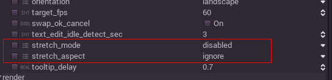

# Multiple Screen Resolutions

### Introduction

There are several types of devices, with several types of screens, which in turn have different pixel density and resolutions. Handling all of them can be a lot of work, so Godot tries to make the developer's life a little easier. The [Viewport](class_vewport) node has several functions to handle resizing, and the root node of the scene tree is always a viewport (scenes loaded are instanced as a child of it, and it can always be accessed by calling `get_scene().get_root()` or `get_node("/root")` ). 

In any case, while changing the root Viewport params is probably the most flexible way to deal with the problem, it can be a lot of work and guessing, so Godot provides a simple set of parameters in the project settings to handle multiple resolutions.

### Stretch Settings

Stretch settings are located in the project settings, it's just a bunch of configuration variables that provide several options:

