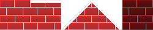
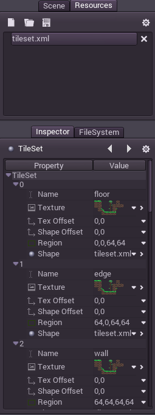
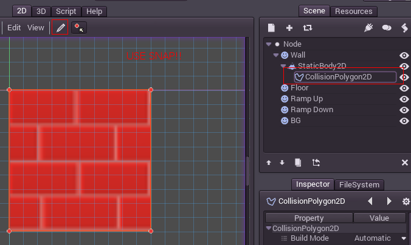

#Creating a Tilemap

### Introduction
Tilemaps are a simple and quick way to make 2D game levels. Basically, you start with bunch of reference tiles (or pieces) that can be put in a grid, as many times each as desired:

Collision can also be added to the tiles, allowing for both 2D side scroller or top down games.

###Making a Tileset

To begin with, a tileset needs to be made. Here are some tiles for it. They are all in the same image because artists will often prefer this. Having them as separate images also works too.

Create a new project and throw the above png image inside.

###Create the TileSet Scene

We will be creating a [TileSet](class_tileset) resource. While this resource exports properties, it's pretty difficult to get complex data into it and maintain it:

There's enough properties to get by, and with some effort editing this way can work, but the easiest way to edit and maintain a tileset is with the export tool!

###TileSet Scene

Create a new scene with a regular node or node2d as root. For each new a sprite will be added. Since tiles here are 50x50, enabling snap might be a good idea. 

If more than one tile is present in the source image, make sure to use the region property of the sprite to adjust which of the sprites is the source texture is being edited.

Finally, make sure to name your sprite node correctly, this will ensure that, in subsequent edits to the tileset (for example, if added collision, changed the region, etc), the tile will still be **identified correctly and updated**. This name should be unique.

Sounds like a lot of requirements, so here's a screenshot that shows where everything of relevance is:

Continue adding all the tiles, adjust the offsets if needed (if you use multiple tiles in a single image) unless there is a sprite per each tile. Again, as always, remember that their names must be unique.

 

###Collision

To add collision to a tile, create a StaticBody2D child for each sprite. This is a static collision node. Then, as a child of the StaticBody2D, create a CollisionShape2D or CollisionPolygon. The later is recommended because it's easier to edit:

 

Finally, edit the polygon, this will give the tile a collision. **Remember to use snap!**. Using snap will make sure collision polygons are aligned properly, allowing a character to walk seamlessly from tile to tile.

 

Keep adding collisions to tiles untile we are done. Note that BG is just a BG so we don't care about it.

 

OK! We're done! remember to save this scene for future edit, call it "tileset_edit.scn" or something like that.

###Exporting a TileSet

With the scene created and opened in the editor, next step will be to create a tileset. Use Scene > Convert To > Tile Set from the Scene Menu:

 

Then choose a filename, like "mytiles.res". Make sure the "Merge With Existing" option is toggled on. This way, every time the tileset resource file is overwritten, existing tiles are merged and updated (they are referenced by their unique name, so again, **name your tiles properly**).

 

###Using the TileSet in a TileMap

Create a new scene, use any node or node2d as root, then create a [TileMap](class_tilemap) as a child.

 

Go to the tileset property of this node and assign the one created in previous steps:

 

Also set the cell size to '50', since that is the size used by the tiles. Quadrant size is a tuning value, which means that the engine will draw and cull the tilemap in blocks of 16x16 tiles. This value is usually fine and does not need to be changed, but can be used to tune performance in specific cases (if you know what you are doing).

###Paiting Your World

With all set, make sure the TileMap node is selected. A red grid will appear on screen, allowing to paint on it with the selected tile on the left pallete.

 

To avoid moving and selecting the tilemap node accidentally (something common given it's a huge node), it is recommended that you lock it, using the lock button:

 

###Scaling Artifacts

When using a single texture for all the tiles, scaling the tileset (or even moving to a non pixel-aligned location) will most likely result in filtering artifacts like this:

This can't be avoided, as it is the way the hardware bilinear filter works. So, to avoid this situation, there are a few workarounds:

* Disable filtering for either the tileset texture or the entire image loader (see the [Image Files](image_files) asset pipeline tutorial).
* Use a single image for each tile.
* Viewport Scaling can often help shrinking the map (see the [Viewports](tutorial_viewports) tutorial).

