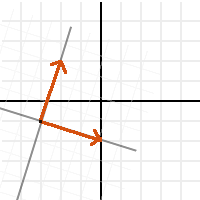
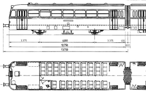
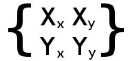

# Matrices & Transforms

### Introduction

Before reading this tutorial, it is advised to read the previous one about [vector math](tutorial_vector_math) as this one is a direct continuation.

Matrices and transforms are pretty much the same. Well not really. These terms are all over the place so It's quite difficult. We'll get familiar with 3 terms here: **Transform**, **Matrix** and **Oriented Coordinate System** (too long let's use **OCS**). It's more like one is a subset of the other, but don't despair yet! While this field is pretty large, we'll just work with the subset that matters. We'll learn this by going _backwards_.

### Oriented Coordinate System (OCS)

Imagine we have a spaceship somewhere in space. In Godot this is easy, just move the ship somewhere and rotate it:

<p align="center"></p>

Ok, so in 2D this looks simple, a position and an angle for a rotation. But remember, we are grown ups here and don't use angles (plus, angles are not really even that useful when working in 3D).

We should realize that at some point, someone _designed_ this spaceship. Be it for 2D in a drawing such as Paint.net, Gimp, Photoshop, etc. or in 3D through a 3D DCC tool such as Blender, Max, Maya, etc.
When it was designed, it was not rotated. It was designed in it's own _coordinate system_. 

<p align="center"></p>

This means that the tip of the ship has a coordinate, the fin has another, etc. Be it in pixels (2D) or vertices (3D). 
So, let's recall again that the ship was somewhere in space:

<p align="center"></p>

How did it get there? What moved it and rotated it from the place it was designed to it's current position? The answer is... a **transform**, the ship was _transformed_ from their original position to the new one. This allows the ship to be displayed where it is.

So, a transform is too generic of a term. To solve this puzzle, we will overimpose the ship's original design position at their current position:

<p align="center"></p>

So, we can see that the "design space" has been transformed too. How can we best represent this transformation? Let's use 3 vectors for this (in 2D), a normal pointing towards X positive, a normal pointing towards Y positive and a translation.

<p align="center"></p>

Let's call the 3 vectors "X", "Y" and "Origin", and let's also overimpose them over the ship so it makes more sense:

<p align="center"></p>

Ok, this is nicer, but it still does not make sense. What do X,Y and Origin have to do with how the ship got there?

Well, let's take the point from top tip of the ship as reference:

<p align="center"></p>

And let's apply the following operation to it (and to all the points in the ship too, but we'll track the top tip as our reference point):

```python
var new_pos = pos - origin
```

Doing this to the selected point will move it back to the center:

<p align="center"></p>

This was expected, but then let's do something more interesting. Use the dot product of X and the point, and add it to the dot product of Y and the point:

```python
var final_pos = x.dot(new_pos) + y.dot(new_pos)
```
Then what we have is.. wait a minute, it's the ship in it's design position!

<p align="center"></p>

How did this black magic happen? The ship was lost in space, and now it's back home!
It might seem strange, but it does have plenty of logic. Remember, as we have seen in the [previous tutorial](tutorial_vector_math#distance-to-plane), what happened is that the distance to X axis, and the distance to Y axis were computed. Calculating distance in a direction or plane was one of the uses for the dot product. This was enough to obtain back the design coordinates for every point in the ship.

So, what he have been working with so far (with X, Y and Origin) is an **Oriented Coordinate System**. X an Y are the **Basis**, and **Origin** is the offset.

### Basis

The Origin we know what it is. It's where the 0.0 (origin) of the design coordinate system ended up after being transformed to a new position. This is why it's called _Origin_, But in practice, it's just an offset to the new position.

The Basis is more interesting. The basis is the X and Y of the new, transformed, OCS are pointing towards. It's telling what is in change of drawing 2D and 3D "Hey, the original X and Y axes or your design are _right here_, pointing towards _these directions_".

So, let's change the representation of the basis. Instead of 2 vectors, let's use a _matrix_.

<p align="center"></p>

The vectors are up there in the matrix, horizontally. The next problem now is that.. what is this matrix thing? Well, we'll assume you've never heard of a matrix. 

### Transforms in Godot

This tutorial will not explain matrix math (and their operations) in depth, only it's practical use. There is plenty of material for that, which should be a lot simpler to understand after completing this tutorial. We'll just explain how to use transforms.

### Matrix32

[Matrix32](class_matrix32) is a 3x2 matrix. It has 3 Vector2 elements and it's used for 2D. The "X" axis is the element 0, "Y" axis is the element 1 and "Origin" is element 2. It's not divided in basis/origin for convenience, due to it's simplicity.

```python
var m = Matrix32()
var x = m[0] # 'X'
var y = m[1] # 'Y'
var o = m[2] # 'Origin'
```

Most operations will be explained with this datatype (Matrix32), but the same logic applies to 3D.

#### Identity

By default, Matrix32 is created as an "identity" matrix. This means:

* 'X' Points right: Vector2(1,0)
* 'Y' Points up (or down in pixels): Vector2(0,1)
* 'Origin' is the origin Vector2(0,0)

<p align="center"></p>

It's easy to guess that an _identity_ matrix is just a matrix that aligns the transform to it's parent coordinate system. It's an **OCS** that hasn't been translated, rotated or scaled. All transform types in Godot are created with _identity_.

#### Operations

Rotating Matrix32 is done by using the "rotated" function:

```
var m = Matrix32()
m = m.rotated(PI/2) # rotate 90°
```

<p align="center"></p>

There are two ways to translate a Matrix32, the first one is just moving the origin:
```
# Move 2 units to the right
var m = Matrix32()
m = m.rotated(PI/2) # rotate 90°
m[2]+=Vector2(2,0)
```

<p align="center"></p>

This will always work in global coordinates.
If instead, translation is desired in _local_ coordinates of the matrix (towards where the _basis_ is oriented), there is the [Matrix32.translated](class_matrix32#translated) method:

```
# Move 2 units towards where the basis is oriented
var m = Matrix32()
m = m.rotated(PI/2) # rotate 90°
m=m.translated( Vector2(2,0) )
```

<p align="center"></p>


A matrix can be scaled too. Scaling will multiply the basis vectors by a vetor (X vector by x component of the scale, Y vector by y component of the scale). It will leave the origin alone:

 ```
# Make the basis twice it's size.
var m = Matrix32()
m = m.scaled( Vector2(2,2) )
```
<p align="center"></p>

These kind of operations in matrices are accumulative. It means every one starts relative to the previous one. For those that have been living on this planet long enough, a good reference of how transform works is this:

<p align="center"></p>

A matrix is used similarly to a turtle. The turtle most likely had a matrix inside..

#### Transform

Transform is the act of switching between coordinate systems. To convert a position (either 2D or 3D) from "designer" coordinate system to the OCS, the "xform" method is used.

```python
var new_pos = m.xform(pos)
```
And only for basis (no translation):

```python
var new_pos = m.basis_xform(pos)
```

Post - multiplying is also valid:

```python
var new_pos = m * pos
```

To do the opposite operation (what we did up there with the rocket), the "xform_inv" method is used:

```python
var new_pos = m.xform_inv(pos)
```
Only for Basis:
```python
var new_pos = m.basis_xform_inv(pos)
```

Or pre-multiplication:

```python
var new_pos = pos * m
```

However, if the Matrix has been scaled (vectors are not normals), or the basis vectors are not orthogonal (90°), the inverse transform will not work. 
In other words, inverse transform is only valid in _orthonormal_ matrices. For this, these cases an affine inverse must be computed.

The transform, or inverse transform of an identity matrix will return the position unchanged:

```python
# Does nothing, pos is unchanged
pos = Matrix32().xform(pos)
```

#### Affine Inverse

The affine inverse is a matrix that does the inverse operation of another matrix, no matter if the matrix has scale or the axis vectors are not orthogonal. The affine inverse is calculated with the affine_inverse() method:

```python
var mi = m.affine_inverse()
var pos = m.xform(pos)
pos = mi.xform(pos)
#pos is unchanged
```
If the matrix is orthonormal, then:

```python
#if m is orthonormal, then
pos = mi.xform(pos)
#is the same is
pos = m.xform_inv(pos)
```

#### Matrix Multiplication

Matrices can be multiplied. Multiplication of two matrices "chains" (concatenates) their transforms.
However, as per convention, multiplication takes place in reverse order.

Example:
```python
var m = more_transforms * some_transforms
```

To make it a little clearer, this:

```python
pos = transform1.xform(pos)
pos = transform2.xform(pos)
```

Is the same as:

```python
# note the inverse order
pos = (transform2 * transform1).xform(pos)
```
However, this is not the same:

```python
# yields a different results
pos = (transform1 * transform2).xform(pos)
```
Because in matrix math, A * B is not the same as B * A.

Multiplying a matrix by it's inverse, results in identity

```python
# No matter what A is, B will be identity
B = A.affine_inverse() * A
```

Multiplying a matrix by identity, will result in the unchanged matrix:

```python
# B will be equal to A
B = A * Matrix32()
```

#### Matrix tips

When using a transform hierarchy, remember that matrix multiplication is reversed! To obtain the global transform for a hierarchy, do:

```python
var global_xform = parent_matrix * child_matrix
```

For 3 levels:

```python
# due to reverse order, parenthesis are needed
var global_xform = gradparent_matrix * (parent_matrix * child_matrix)
```

To make a matrix relative to the parent, use the affine inverse (or regular inverse for orthonormal matrices).

```python
# transform B from a global matrix to one local to A
var B_local_to_A = A.affine_inverse() * B
```

Revert it just like the example above:

```python
# transform back local B to global B
var B = A * B_local_to_A
```

OK, hopefully this should be enough! Let's complete the tutorial by moving to 3D matrices

### Matrices & Transforms in 3D


