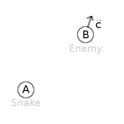
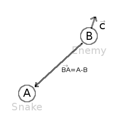

# Vector Math

### Introduction

This small tutorial aims to be a short and practical introduction to vector math, useful for 3D but also 2D games. Again, vector math is not only useful for 3D but _also_ 2D games. It is an amazing tool once you get the grasp of it and makes programming of complex behaviors much simpler.

It often happens that young programmers rely too much on the _incorrect_ math for solving a wide array of problems, for example using only trigonometry instead of vector of math for 2D games.

This tutorial will focus on practical usage, with immediate application to the art of game programming.

### Coordinate Systems (2D)

Typically, we define coordinates as an (x,y) pair, x representing the horizontal offset and y the vertical one. This makes sense given the screen is just a rectangle in two dimensions. As an example, here is a position in 2D space:

<p align="center"></p>

A position can be anywhere in space. The position (0,0) has a name, it's called the **origin**. Remember this term well because it has more implicit uses later. The (0,0) of a n-dimensions coordinate system is the **origin**.

In vector math, coordinates have two different uses, both equally important. They are used to represent a _position_ but also a _vector_. The same position as before, when imagined as a vector, has a different meaning.

<p align="center"></p>

When imagined as a vector, two properties can be inferred, the **direction** and the **magnitude**. Every position in space can be a vector, with the exception of the **origin**. This is because coordinates (0,0) can't represent direction (magnitude 0).

<p align="center"></p>

#### Direction

Direction is simply towards where the vector points to. Imagine an arrow that starts at the **origin** and goes towards a **position**. The tip of the arrow is in the position, so it always points outwards, away from the origin. Imagining vectors as arrows helps a lot.

<p align="center"></p>

#### Magnitude

Finally, the length of the vector is the distance from the origin to the position. Obtaining the length from a vector is easy, just use the [Pithagorean Theorem](http://en.wikipedia.org/wiki/Pythagorean_theorem).

```python
var len = sqrt( x*x + y*y )
```

#### But.. Angles?

But why not using an _angle_? After all, we could also think of a vector as an angle and a magnitude, instead of a direction and a magnitude. Angles also are a more familiar concept.

To say truth, angles are not that useful in vector math, and most of the time they are not dealt with directly. Maybe they work in 2D, but in 3D a lot of what can usually be done with angles does not work anymore. 

Still, using angles is still not an excuse, even for 2D. Most of what takes a lot of work with angles in 2D, is still much more natural easier to accomplish with vector math. In vector math, angles are useful only as measure, but take little part in the math. So, give up the trigonometry already, prepare to embrace vectors!

In any case, obtaining an angle from a vector is easy and can be accomplished with trig.. er what was that? I mean, the [atan2(x,y)](class_@gdscript#atan2) function.

### Vectors in Godot

To make examples easier, it is worth explaining how vectors are implemented in GDScript. GDscript has both [Vector2](class_vector2) and [Vector3](class_vector3), for 2D and 3D math respectively. Godot uses Vector classes as both position and direction. They also contain x and y (for 2D) and x, y and z (for 3D) member variables.

```python
# create a vector with coordinates (2,5)
var a = Vector2(2,5)
# create a vector and assign x and y manually
var b = Vector2()
b.x=7
b.y=8
```

When operating with vectors, it is not necessary to operate on the members directly (in fact this is much slower). Vectors support regular arithmetic operations:

```python
#add a and b
var c = a+b
# will result in c vector, with value (9,13)
```
It is the same as doing:

```python
var c = Vector2()
c.x=a.x+b.x
c.y=a.y+b.y
```
Except the former is way more efficient and readable.

Regular arithmetic operations such as addition, subtraction, multiplication and division are supported.
Vector multiplication and division can also be mixed with single-digit numbers, also named **scalars**.

```python
# Multiplication of vector by scalar
var c = a*2.0
# will result in c vector, with value (4,10)
```

Which is the same as doing

```python
var c = Vector2()
c.x = a.x*2.0
c.y = a.y*2.0
```
Except, again, the former is way more efficient and readable.

### Normal Vectors

Ok, so we know what a vector is. It has a **direction** and a **magnitude**. We also know how to use them in Godot. The next step is learning about **normal vectors** (also called _unit vectors_ or just _normals_). Any vector with **magnitude** of length 1 is considered a **normal vector**. In 2D, imagine drawing a circle of radius one. That circle contains all normal vectors in existence for 2 dimensions:

<p align="center"></p>

So, what is so special about normal vectors? Normal vectors are amazing. In other words, normal vectors have **several, very useful properties**.

Can't wait to know more about the fantastic properties of normal vectors, but one step at a time. So, how is a normal vector created from a regular vector?

#### Normalization

Taking any vector and reducing it's **magnitude** to 1.0 while keeping it's **direction** is called **normalization**. Normalization is performed by dividing the x and y (and z in 3D) components of a vector by it's magnitude:

```python
var a = Vector2(2,4)
var m = sqrt( a.x*a.x + a.y*a.y )
a.x/=m
a.y/=m
```
As you might have guessed, if the vector has magnitude 0 (meaning, it's not a vector but the **origin**), a division by zero occurs and the universe goes through a second big bang, except in reverse polarity and then back. As a result, humanity is safe but Godot will print an error. Remember! Vector(0,0) can't be normalized! No, Unity can't normalize it either, so don't switch back engines yet.

Of course, Vector2 and Vector3 already provide a method to do this:
```python
a = a.normalized()
```

### Dot Product

OK, the **dot product** is the most important part of vector math. Without the dot product, Quake would have never been made. This is the most important section of the tutorial, so make sure to grasp it properly. Most people trying to understand vector math give up here because, despite how simple it is, they can't make head or tails from it. Why? Here's why, it's because..

The dot product takes two vectors and returns a **scalar**:

```python
var s = a.x*b.x + a.y*b.y
```

Yes, pretty much that. Multiply **x** from vector **a** by **x** from vector **b**. Do the same with y and add it together. In 3D it's pretty much the same:

```python
var s = a.x*b.x + a.y*b.y + a.z*b.z
```
I know, it's totally meaningless! you can even do it with a built-in function:

```python
var s = a.dot(b)
```
This is where despair begins and books and tutorials show you this formula:

<p align="center"></p>

And you realize it's time to give up making 3D games or complex 2D games. How can something so simple be so complex?. Someone else will have to make the next Zelda or Call of Duty. Top down RPGs don't look so bad after all. Yeah I hear someone did pretty will with one of those on Steam..

So this is your moment, this is your time to shine. **DO NOT GIVE UP**! At this point, this tutorial will take a sharp turn and focus on what makes the dot product useful. This is, **why** it is useful. We will focus one by one in the use cases for the dot product, with real-life applications. No more formulas that don't make any sense. Formulas will make sense _once you learn_ why do they exist for.

#### Siding

The first useful and most important property of the dot product is to check what side stuff is looking at. Let's imagine we have any two vectors, **a** and **b**. Any **direction** or **magnitude** (neither  **origin**). Does not matter what they are, but let's imagine we compute the dot product between them.

```python
var s = a.dot(b)
```

The operation will return a single floating point number (but since we are in vector world, we call them **scalar**, will keep using that term from now on). This number will tell us the following:

* If the number is greater than zero, both are looking towards the same direction (the angle between them is < 90° degrees).
* If the number is less than zero, both are looking towards opposite direction (the angle between them is > 90° degrees).
* If the number is zero, vectors are shaped in L (the angle between them _is_ 90° degrees).

<p align="center"></p>

So let's think of a real use-case scenario. Imagine Snake is going through a forest, and then there is an enemy nearby. How can we quickly tell if the enemy has seen discovered Snake? In order to discover him, the enemy must be able to _see_ Snake. Let's say, then that:

* Snake is in position **A**.
* The enemy is in position **B**.
* The enemy is _facing_ towards direction vector **F**.

<p align="center"></p>

So, let's create a new vector **BA** that goes from the guard (**B**) to Snake (**A**), by subtracting the two:

```python
var BA = A-B
```

<p align="center"></p>

Ideally, if the guard was looking straight towards snake, to make eye to eye contact, it would do it in the same direction as vector BA.

The dot product between **F** and **BA** is greater than 0 will determine if Snake has been discovered. This happens because we will be able to tell that the guard is facing towards snake:

```python
if ( BA.dot(F) > 0 ):
    print("!")
```

Seems Snake is safe so far.
